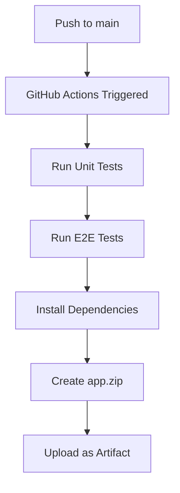
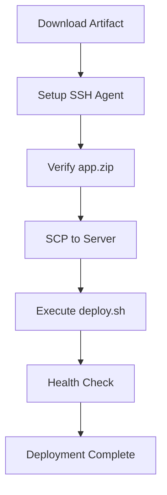
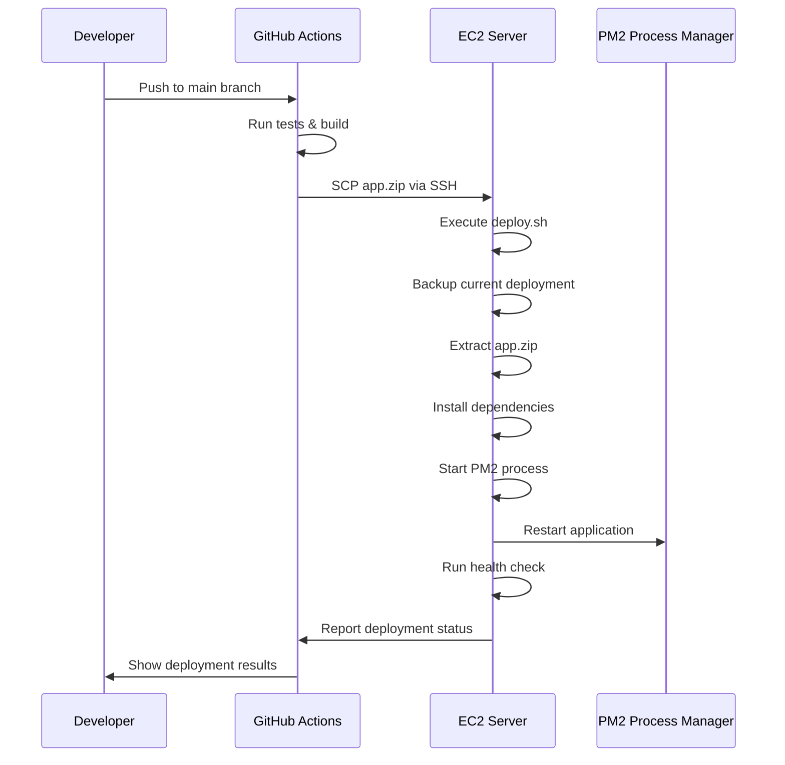

# Rsync-Free Deployment Solution - End-to-End Explanation

This document provides a complete overview of the safe, rsync-free deployment solution that has been implemented for your API application.

## Solution Overview

The deployment solution consists of three main components:

1. **Updated GitHub Actions Workflow** - Uses SCP instead of rsync
2. **deploy.sh Script** - Runs on the server to handle deployment
3. **One-Time Server Setup** - Initial configuration for the EC2 instance

## Key Benefits

- ✅ **No rsync dependency** - Uses standard SCP for file transfer
- ✅ **Safe deployment process** - Atomic deployment with rollback capability
- ✅ **No SSH key modifications** - Never touches `~/.ssh/authorized_keys`
- ✅ **Reliable artifact handling** - Uses zip files for consistent transfers
- ✅ **Automatic dependency management** - Handles npm install and PM2 configuration
- ✅ **Health checks** - Verifies deployment success
- ✅ **Detailed logging** - Clear status messages throughout the process

## How It Works

### 1. Build & Create Artifact



**Process:**
- GitHub Actions runs on `push` to `main` branch
- Executes Jest unit tests and Cypress E2E tests
- Installs production dependencies
- Creates `app.zip` excluding unnecessary files (node_modules, coverage, logs)
- Includes `deploy.sh` in the artifact
- Uploads as GitHub artifact

### 2. Deploy to Server



**Process:**
1. **Download Artifact**: GitHub Actions downloads the zip file
2. **SSH Setup**: Configures SSH agent with private key from secrets
3. **SCP Transfer**: Securely copies `app.zip` to `/var/www/api/` on server
4. **Execute deploy.sh**: Server-side script handles:
   - Backup current deployment
   - Extract new files
   - Install dependencies
   - Configure environment
   - Restart PM2
   - Run health checks

### 3. Server-Side Deployment Script

The `deploy.sh` script performs these operations:

```bash
# 1. Backup current deployment
mv current previous

# 2. Extract new deployment
mkdir current && cd current
unzip ../app.zip

# 3. Install dependencies
npm ci --omit=dev

# 4. Configure environment
echo "NODE_ENV=production" > .env
echo "PORT=4000" >> .env

# 5. Setup PM2
pm2 start ecosystem.config.js --env production

# 6. Health check
curl -f http://localhost:4000/api/health
```

## Security Features

### No SSH Key Modification
- ✅ Never modifies `~/.ssh/authorized_keys`
- ✅ Uses GitHub Secrets for SSH credentials
- ✅ SSH agent setup in CI/CD environment only

### Secure File Transfer
- ✅ Uses SCP over SSH for encrypted transfer
- ✅ Validates artifact before deployment
- ✅ Handles transfer failures gracefully

### Safe Deployment Process
- ✅ Atomic deployments (all-or-nothing)
- ✅ Automatic rollback capability
- ✅ Health checks after deployment
- ✅ Detailed logging and status reporting

## Configuration Required

### GitHub Repository Secrets
Add these secrets to your GitHub repository:

| Secret Name | Description | Example |
|-------------|-------------|---------|
| `SSH_KEY` | Private SSH key for server access | Content of `~/.ssh/id_ed25519` |
| `SSH_USER` | SSH username on EC2 instance | `ubuntu` |
| `SSH_HOST` | Server IP or domain | `123.456.789.0` |
| `SERVER_PATH` | Deployment directory | `/var/www/api` |
| `ENV_NODE_ENV` | Node environment | `production` |
| `ENV_PORT` | Application port | `4000` |

### Server Requirements
- Ubuntu/Debian-based EC2 instance
- Node.js 20+ installed
- PM2 installed globally
- Nginx (optional, for reverse proxy)
- Deployment directory with proper permissions

## Deployment Flow



## Rollback Capability

The solution provides automatic rollback:

1. **Before deployment**: Current deployment is moved to `previous/`
2. **After deployment**: If health check fails, manual rollback possible:
   ```bash
   cd /var/www/api
   rm -rf current
   mv previous current
   cd current
   pm2 restart ecosystem.config.js --env production
   ```

## Monitoring & Logs

### Application Logs
- PM2 logs: `pm2 logs api-app`
- Log files: `/var/www/api/logs/`
- Nginx logs: `/var/log/nginx/`

### Health Monitoring
- Health endpoint: `GET /api/health`
- PM2 status: `pm2 status`
- Application status: `curl http://localhost:4000/api/health`

## Advantages Over Rsync

| Feature | Rsync Solution | SCP + deploy.sh Solution |
|---------|---------------|-------------------------|
| **File Transfer** | Complex rsync flags | Simple SCP |
| **Dependencies** | Requires rsync on both ends | Standard SSH/SCP |
| **Atomic Deployment** | Partial transfers possible | Complete atomic deployment |
| **Rollback** | Manual file management | Automatic backup/restore |
| **Error Handling** | Complex rsync error checking | Simple script-based validation |
| **Security** | More attack surface | Minimal, standard SSH |

## Quick Start Checklist

- [ ] Set up EC2 instance with one-time setup commands
- [ ] Add GitHub repository secrets
- [ ] Push code to `main` branch
- [ ] Verify deployment in GitHub Actions logs
- [ ] Test application endpoints
- [ ] Monitor logs for any issues

## Troubleshooting

### Common Issues

1. **Permission denied on server**
   ```bash
   sudo chown -R $USER:$USER /var/www/api
   ```

2. **PM2 startup fails**
   ```bash
   pm2 startup  # Follow instructions to run the suggested command
   ```

3. **Nginx not responding**
   ```bash
   sudo systemctl status nginx
   sudo nginx -t  # Test configuration
   ```

4. **Health check fails**
   ```bash
   pm2 logs api-app  # Check application logs
   curl -v http://localhost:4000/api/health  # Manual health check
   ```

### Debug Commands
```bash
# Check deployment status
ls -la /var/www/api/

# Check PM2 processes
pm2 status
pm2 logs api-app --lines 50

# Check nginx status
sudo systemctl status nginx
sudo nginx -t

# Manual health check
curl -v http://localhost:4000/api/health
```

## Conclusion

This rsync-free deployment solution provides a robust, secure, and maintainable approach to deploying your API application. It leverages standard tools (SSH, SCP, PM2) and provides excellent error handling, rollback capabilities, and monitoring features.

The solution eliminates the complexity and potential security issues associated with rsync while providing a more reliable and auditable deployment process.